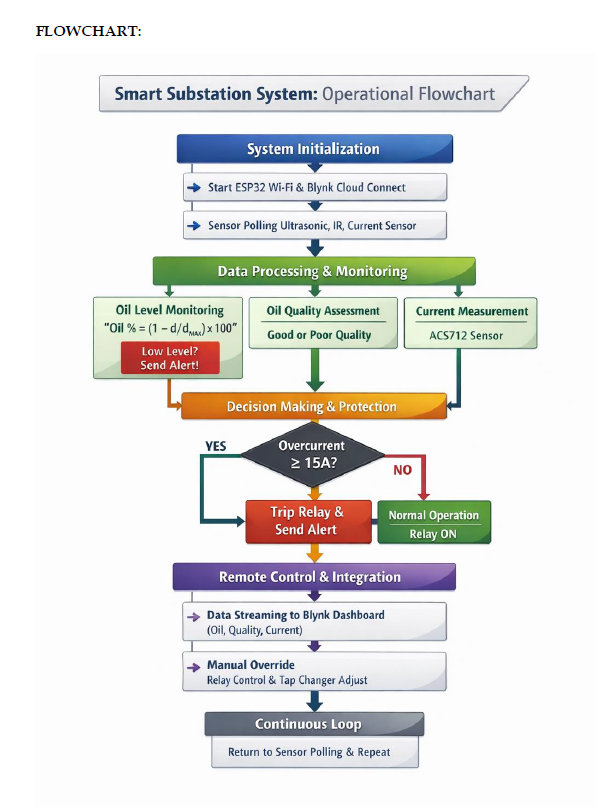
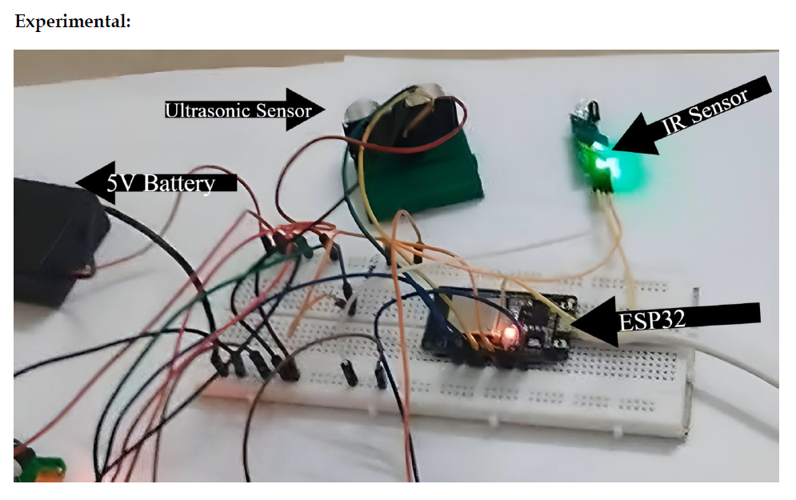
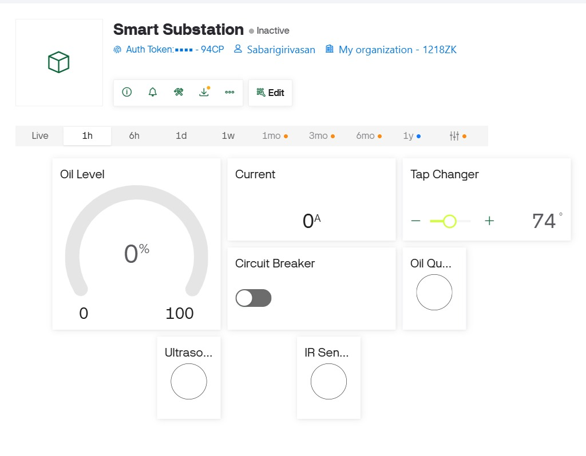

# IoT-Based Smart Substation Monitoring & Control System

An ESP32-based IoT solution for real-time monitoring and control of critical substation parameters, including oil level, oil quality, and load current.

The system provides remote monitoring through the Blynk platform and implements automatic protection mechanisms for fault conditions.

## Features

- Real-time oil level monitoring using an ultrasonic sensor
- Oil quality estimation using an IR sensor
- Current monitoring using ACS712/CT sensor
- Automatic overcurrent protection with relay tripping
- Remote circuit breaker control via Blynk
- Servo-based tap changer simulation
- Sensor health monitoring and fault detection
- Mobile dashboard for real-time visualization

## Hardware Components

| Component | Purpose |
|-----------|---------|
| ESP32 | Main controller with Wi-Fi |
| HC-SR04 Ultrasonic Sensor | Oil level monitoring |
| IR Sensor | Oil quality estimation |
| ACS712 / CT Sensor | Current measurement |
| Relay Module | Circuit breaker control |
| SG90 Servo Motor | Tap changer simulation |
| Blynk Platform | IoT dashboard |

## System Architecture

## Hardware Prototype

## Blynk Dashboard

## Working Principle

1. ESP32 acquires sensor data continuously.
2. Oil level is calculated using ultrasonic distance measurements.
3. Oil quality is estimated using IR sensor readings.
4. Current values are monitored in real time.
5. If current exceeds the threshold value, the relay trips automatically.
6. Sensor data is transmitted to the Blynk cloud.
7. Users can remotely control the relay and tap changer through the mobile application.

## Circuit Connections

| ESP32 Pin | Component |
|-----------|------------|
| GPIO 33 | HC-SR04 Trigger |
| GPIO 32 | HC-SR04 Echo |
| GPIO 35 | IR Sensor |
| GPIO 34 | ACS712 |
| GPIO 27 | Relay Module |
| GPIO 13 | Servo Motor |

## Software Used

- Arduino IDE
- Blynk IoT Platform
- Embedded C/C++
- KiCad

## Challenges Faced

- Current sensor noise filtering
- Ultrasonic sensor instability
- Relay active LOW logic debugging
- IR Sensor calibration

## Applications

- Smart electrical substations
- Transformer health monitoring
- Industrial automation
- Smart grid systems
- Remote power system management

## Future Improvements

- Replace IR sensor with a turbidity sensor for better oil quality analysis
- Add cloud data logging and analytics
- Implement predictive maintenance using machine learning
- Integrate additional transformer health parameters

## Authors

- SSV Mridula
- Sabarigirivasan S
- Swetha CA
